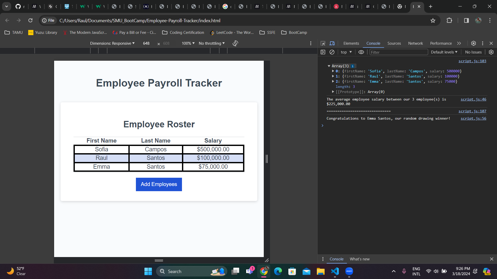

# Employee-Payroll-Tracker

## Description

An Employee Payroll Tracker that logs and displays user entered employee data, including their first name, last name, and salary.

In addition, this webpage calculates the average employee salary and selects a random employee.

## Link

[Click Here to Deploy Page](https://raulds-fmtx.github.io/Employee-Payroll-Tracker/)

## Usage

To use this webpage, click 'Add Employees' whereupon you will be prompted to enter an employees information (first name, last name, salary). After answering these prompts, confirm whether or not you will add another employee. If you choose to add another employee, follow the prompts until all employees have been added. To see the average employee salary and randomly selected employee, click `Ctrl+Shift+I` and switch to the 'Console' view. The aforementioned information will be displayed there.

To add a new set of employees, simply click 'Add Employees' and repeat the above process.

## Credits

Created by Raul Santos

## License

Please refer to the LICENSE in the repo.
